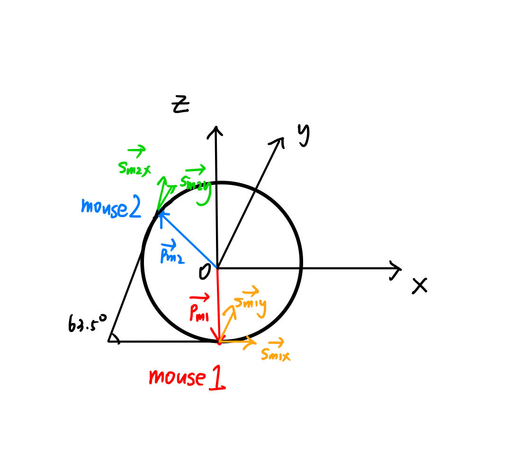

# py_mouse_ball

## 1.Install dependencies

```
conda create -n mouseball python=3.9
conda activate mouseball
pip install pyqt5 pyusb numpy matplotlib
```

## 2.Install mouse driver

Download [Zadig](https://zadig.akeo.ie/), which is a Windows application that installs generic USB drivers. Then install libusb driver for the mouse following the steps below.

```
1. Options > List all devices
2. Choose the mouse used for ball tracking
3. Choose libusb-win32 driver
4. Install driver
```

<div align="center">

</div>

If the driver is successfully installed, you'll be able to find in Device Manager that the mouse has now become a libusb-win32 device (and it's unable to control the cursor on your screen now).

<div align="center">

</div>

## 3.Test

```
python test.py
```

## 4.Method

Mouse Setting: \
Two "Logitech G102 LIGHTSYNC Gaming Mouse" are used to detect the ball rotation. One is fixed at the bottom of the ball, with its
Y and X sensing axis parallel to the forward walking and side stepping direction of the fruit fly (Mouse 1).
The installation method of another mouse (Mouse 2) is as shown in the figure above, with its sensing plane inclined at an angle of 63.5° relative to
Mouse 1.

<div align="center">


</div>  
</br>

Calcualtion of the fictive path: \
The sensing point of Mouse 1 on the ball has a position vector $${\boldsymbol{p}}_{m1}$$. When the ball rotates with angular velocity vector $\omega$, the circumferential speed ${\boldsymbol{\upsilon}}_{m1}$ of the ball at that point is:

$$
{\boldsymbol{\upsilon}}_{m1} = \boldsymbol{\omega} \times {\boldsymbol{p}}_{m1}.
\tag{1}
$$

Let ${\boldsymbol{s}}_{m1x}$ be the unit vector along the X sensing axis of Mouse 1, then the component of ${\boldsymbol{\upsilon}}_{m1}$ along ${\boldsymbol{s}}_{m1x}$ can be obtained by:

$$
\begin{aligned}\upsilon_{m1x} &= {\boldsymbol{s}}_{m1x} \cdot {\boldsymbol{\upsilon}}_{m1}, \\ &= {\boldsymbol{s}}_{m1x} \cdot (\boldsymbol{\omega} \times {\boldsymbol{p}}_{m1}), \\ &= \boldsymbol{\omega} \cdot ({\boldsymbol{p}}_{m1} \times{\boldsymbol{s}}_{m1x}).\end{aligned}
\tag{2}
$$

We can calculate $\upsilon_{m1y}$ and $\upsilon_{m2y}$ in the same manner and get an equation (Notice that $\upsilon_{m2x}$ is not used because ${\boldsymbol{p}}_{m2} \times{\boldsymbol{s}}_{m2x}$ and ${\boldsymbol{p}}_{m1} \times{\boldsymbol{s}}_{m1x}$ are not linearly independent, which will result in the matrix $A$ being non-invertible):

$$
\begin{pmatrix}\upsilon_{m1x} \\\upsilon_{m1y} \\\upsilon_{m2y} \\\end{pmatrix}=\begin{pmatrix}{\boldsymbol{p}}_{m1} \times{\boldsymbol{s}}_{m1x} \\{\boldsymbol{p}}_{m1} \times{\boldsymbol{s}}_{m1y} \\{\boldsymbol{p}}_{m2} \times{\boldsymbol{s}}_{m2y} \\\end{pmatrix}\begin{pmatrix}\omega_x \\\omega_y \\\omega_z \\\end{pmatrix}=A\boldsymbol{\omega}.
\tag{3}
$$

According to the mouse setting described above:

$$
{\boldsymbol{p}}_{m1} = \begin{pmatrix}0 \\0 \\-r  \\\end{pmatrix} , {\boldsymbol{p}}_{m2}=\begin{pmatrix}-rcos26.5° \\0 \\rsin26.5°  \\\end{pmatrix},\\[10pt]{\boldsymbol{s}}_{m1x} =\begin{pmatrix}1 \\0 \\0  \\\end{pmatrix},{\boldsymbol{s}}_{m1y} =\begin{pmatrix}0 \\1 \\0  \\\end{pmatrix},{\boldsymbol{s}}_{m2y} =\begin{pmatrix}0 \\1 \\0  \\\end{pmatrix},
$$

where r is the radius of the ball. This gives:

$$
\begin{pmatrix}\omega_x \\\omega_y \\\omega_z \\\end{pmatrix}=A^{-1}\begin{pmatrix}\upsilon_{m1x} \\\upsilon_{m1y} \\\upsilon_{m2y} \\\end{pmatrix}=\frac{1}{r}\begin{pmatrix} \upsilon_{m1y}\\ -\upsilon_{m1x} \\[5pt]-\frac{\upsilon_{m1y}sin26.5°+\upsilon_{m2y}}{cos26.5°} \\\end{pmatrix}.
\tag{4}
$$

The walking vector $w$ and the change in heading direction $\triangle \theta$ of the fruit fly can be computed by:

$$
\tag{5}
\boldsymbol{w}=\begin{pmatrix}w_{forward} \\[5pt]w_{side} \\\end{pmatrix}=\alpha \triangle t\begin{pmatrix}\omega_x \\[5pt]-\omega_y \\\end{pmatrix}=\alpha\begin{pmatrix}d_{m1y} \\[5pt]-d_{m1x} \\\end{pmatrix},
$$

$$
\\[20pt]
\triangle \theta = \alpha \triangle t \omega_z=-\alpha \frac{d_{m1y}sin26.5°+d_{m2y}}{rcos26.5°},
\tag{6}
$$

where $\alpha$ is the calibration factor (mm/pixel), $\triangle t$ is the recording interval, $d_{m1y}$ and $d_{m1x}$ are the pixel displacement reported by Mouse 1 along its Y and X sensing axis, $d_{m1x}$ is the pixel displacement reported by Mouse 2 along its Y snesing axis. And the heading direction $\theta$ of the fly in the current frame $k$ is:

$$
\theta^k = \theta^{k-1} + \triangle \theta,
\tag{7}
$$

and finally, the fictive position $P$ of the fruit fly in the current frame $k$ is:

$$
P^k = \begin{pmatrix}P^k_{forward} \\[5pt] P^k_{side} \\\end{pmatrix} = \begin{pmatrix}P^{k-1}_{forward} \\[5pt] P^{k-1}_{side} \\\end{pmatrix} + \begin{pmatrix} cos\theta^k & -sin\theta^k \\[5pt] sin\theta^k & cos\theta^k \end{pmatrix} \begin{pmatrix}w_{forward} \\[5pt]w_{side} \end{pmatrix}.
\tag{8}
$$
